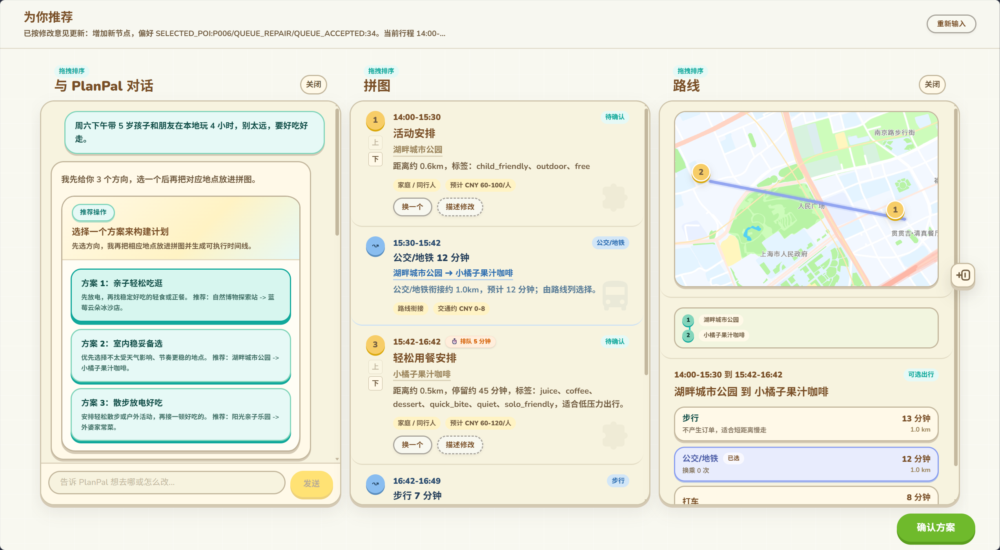

# Plan Pal

美团首届 AI Hackathon 大赛赛道六本地探索周末闲时活动规划参赛作品

PlanPal 不是一个追求通用自治能力的 Agent，而是一个 workflow 驱动的对话式规划系统：通过对话、方案卡、候选卡、拼图时间线和路线视图，帮助用户把模糊的吃喝玩乐需求收敛成可选择、可编辑、可执行的本地活动计划。




交付时的设计文档请看：[PlanPal 设计文档](docs/PLANPAL_STRATEGY_AND_FLOW.md)

## 核心体验

- 首轮不直接生成完整计划，而是先识别用户是在问答、探索、补信息，还是已经可以进入规划。
- 普通规划会先返回 3 个方案方向，让用户选定方向后再生成可执行 timeline。
- 聊天列承接自然语言和方案卡，拼图列展示可编辑时间线，路线列展示地图、路线和交通方式。
- 二次对话会接住当前 workflow 状态，让“选第二个”“换一批”“取消”“想轻松一点”等短指令能延续上下文。
- 确认方案后，系统将当前 timeline 转成购票、订座、打车、通知等外部执行动作。

## 技术栈

- 前端：React + Vite + TypeScript + Tailwind CSS
- 后端：Spring Boot + Spring AI Alibaba
- 通信：HTTP + SSE
- 包管理：pnpm workspace

## 目录结构

```text
plan-pal/
  frontend/   React + Vite + TypeScript 前端
  backend/    Spring Boot + Spring AI 后端
  docs/       API、交接、策略和架构文档
  scratch/    本地临时草稿空间
```

## 环境要求

- Node.js 20+
- pnpm 9+
- Java 17+
- Maven 3.9+

## 安装

```bash
pnpm install
```

## 本地启动

后端：

```bash
pnpm dev:backend
```

前端：

```bash
pnpm dev:frontend
```

默认后端地址：`http://localhost:8081`

健康检查：

```bash
curl http://localhost:8081/api/v1/agent/health
```

预期返回：

```text
Agent is running
```

## 常用命令

```bash
pnpm dev:frontend
pnpm build:frontend
pnpm lint:frontend
pnpm test:backend
pnpm dev:backend
pnpm build
```

`pnpm build` 会执行前端构建和后端测试。

## 运行说明

- `POST /api/v1/agent/plan`：同步创建首轮草稿。
- `GET /api/v1/agent/plan/stream`：通过 SSE 创建首轮草稿。
- `GET /api/v1/agent/plan/{planId}/chat/stream`：处理二次对话、方案选择、候选选择和 patch 修改。
- `POST /api/v1/agent/plan/{planId}/confirm`：确认并执行当前 timeline。
- 普通首轮规划会先返回 `PLAN_CHOICE` / `OPTIONS_READY` 决策态，不会立刻生成可编辑 timeline。
- SSE 流中除了规划进度和终态 `FINISH` / `ERROR` 外，也可能包含后端诊断事件。

当前后端运行时状态保存在内存中：

- `PlanExecutionStore` 保存草稿和版本。
- `SessionStateStore` 保存 pending action、候选集和最近事件。

## 环境变量


重要后端变量：

- `DEEPSEEK_API_KEY`
- `DEEPSEEK_BASE_URL`
- `DEEPSEEK_MODEL`

前端可以通过 `VITE_API_BASE_URL` 覆盖 API 地址。

## 文档

- [PlanPal 策略与链路设计](docs/PLANPAL_STRATEGY_AND_FLOW.md)
- [API](docs/API.md)
- [Handoff](docs/HANDOFF.md)
- [交互路由架构](docs/INTERACTION_ROUTING_ARCHITECTURE.md)
