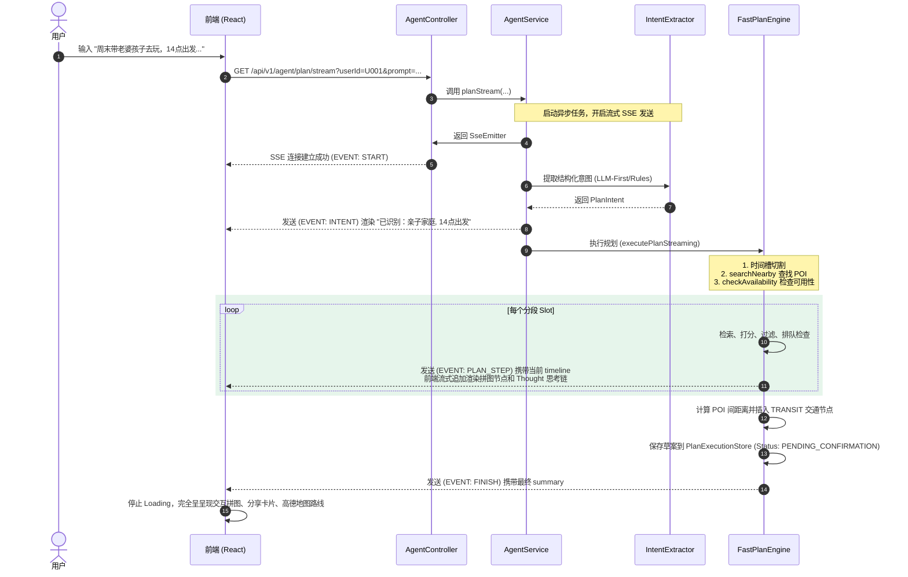
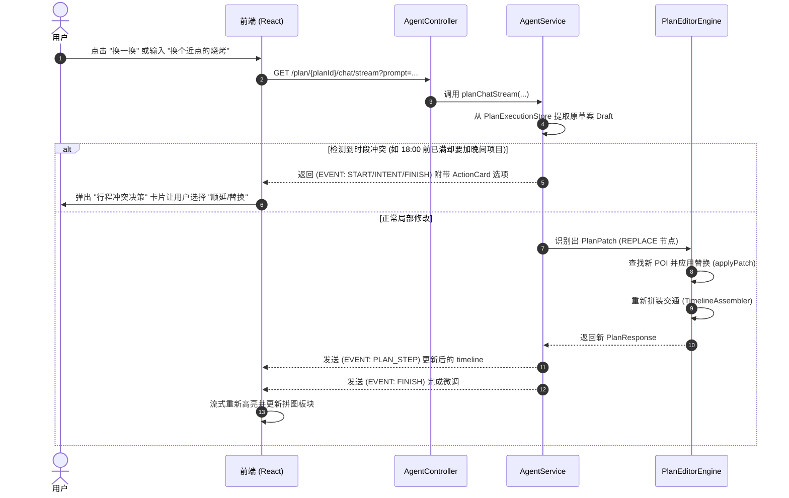
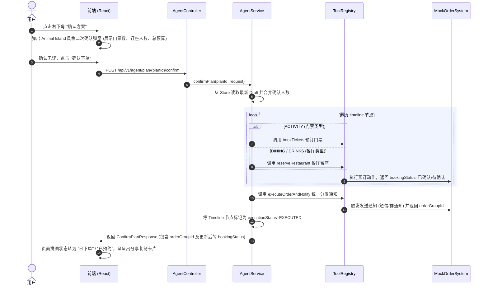

# PlanPal (Weekend Planner Agent) 架构与执行链路深度解析

本报告对 **PlanPal (Weekend Planner Agent)** 周末行程规划智能体系统进行程序架构与执行链路的深度剖析。该系统采用了 React/Vite (TypeScript) 前端与 Spring Boot 后端混合的 **“LLM-First + 规则兜底”** 敏捷架构，通过确定性工具编排保障了 30 秒内高可用行程的稳定输出。

---

## 一、 系统架构概览

PlanPal 在架构设计上体现了现代 Agent 应用的 **有界混合 (Bounded Hybrid)** 哲学：大模型负责意图提取与微调指令抽取；后端高效率 Planner 负责确定性的商户检索、打分、准入控制、排队校验、交通拼图与下单动作。

```mermaid
graph TD
    subgraph Frontend [Vite React TypeScript 前端]
        UI[界面 / Animal Island 风格] --> API_Client[src/api/agent.ts]
        Map[高德地图 API / 渲染与路径重算]
    end

    subgraph Backend_Controller [Spring Boot 控制器层]
        API_Client -->|POST /api/v1/agent/plan/stream| SSE_Plan[GET /plan/stream]
        API_Client -->|POST /api/v1/agent/plan/{planId}/confirm| Confirm_Plan[POST /confirm]
        API_Client -->|GET /api/v1/agent/plan/{planId}/chat/stream| SSE_Chat[GET /chat/stream]
    end

    subgraph Backend_Service [业务服务层]
        SSE_Plan & SSE_Chat & Confirm_Plan --> AgentService[AgentService]
    end

    subgraph Backend_Engine [规划引擎层]
        AgentService --> IntentExtractor[IntentExtractor 意图提取]
        AgentService --> IntentValidator[IntentValidator 意图校验]
        AgentService --> FastPlanEngine[FastPlanEngine 有界规划引擎]
        AgentService --> PlanEditorEngine[PlanEditorEngine 局部修改引擎]
        AgentService --> PlanPatchExtractor[PlanPatchExtractor 局部指令抽取]
        AgentService --> ConsultantEngine[ConsultantEngine 对话咨询引擎]
        
        IntentExtractor -->|守护线程池| LLM_Pool[llm-intent-extractor-pool]
    end

    subgraph Backend_Data [工具与数据源]
        FastPlanEngine --> SearchTool[searchNearby]
        FastPlanEngine --> CheckTool[checkAvailability]
        FastPlanEngine --> TimelineAssembler[TimelineAssembler 交通及节点拼装]
        Confirm_Plan --> BookTickets[bookTickets / reserveRestaurant]
        Confirm_Plan --> ExecuteNotify[executeOrderAndNotify]
        
        PoiDb[(MockPoiDatabase)]
        MovieDb[(MockMovieDatabase)]
        OrderSys[(MockOrderSystem)]
    end

    classDef f fill:#e6f7ed,stroke:#2e7d32,stroke-width:2px;
    classDef c fill:#fff3e0,stroke:#e65100,stroke-width:2px;
    classDef s fill:#e8eaf6,stroke:#1a237e,stroke-width:2px;
    classDef e fill:#efebe9,stroke:#4e342e,stroke-width:2px;
    classDef d fill:#eceff1,stroke:#37474f,stroke-width:2px;
    
    class UI,API_Client,Map f;
    class Backend_Controller,SSE_Plan,Confirm_Plan,SSE_Chat c;
    class AgentService s;
    class IntentExtractor,IntentValidator,FastPlanEngine,PlanEditorEngine,PlanPatchExtractor,ConsultantEngine,LLM_Pool e;
    class SearchTool,CheckTool,TimelineAssembler,BookTickets,ExecuteNotify,PoiDb,MovieDb,OrderSys d;
```

### 1. 前端架构 (React + Vite + TypeScript)
* **技术栈**: React 18, Vite, TypeScript, Vanilla CSS (Animal Island 风格：奶油米白、温暖棕字、薄荷青绿主色、大圆角、厚底 3D 阴影)。
* **API 交互 (`src/api/agent.ts`)**: 
  - 支持 **SSE (Server-Sent Events) 流式通道**，监听 `START`、`INTENT`、`THOUGHT`、`ACTION`、`OBSERVATION`、`PLAN_STEP`、`FINISH` 等事件。
  - **动态交通重算**: 允许用户对生成的卡片进行局部编辑、删除或拖拽排序。排序变化后，前端利用业务节点坐标，重新编排计算交通距离和路线。

### 2. 后端架构 (Spring Boot)
* **控制层 (`AgentController.java`)**: 暴露流式规划、同步规划、方案确认、以及局部调整等四大核心接口。
* **业务编排层 (`AgentService.java`)**: 核心胶水层，负责整合意图解析、规划执行、局部微调和下单网关的控制流。
* **规划引擎层 (`com.weekendplanner.engine`)**:
  - **`IntentExtractor`**: 意图提取器，负责从用户 Prompt 中解析人数、场景、起止时间等实体。
  - **`IntentValidator`**: 意图校验器，执行本地校验规则（例如强校验时间区间、人数，补充缺失项等）。
  - **`FastPlanEngine`**: 有界规划引擎，通过确定性算法与实时工具过滤，稳定高效地生成计划草案。
  - **`PlanEditorEngine` & `PlanPatchExtractor`**: 微调与局部修补引擎，在已有 timeline 上进行节点替换、顺延或重规划。
* **工具与网关层 (`com.weekendplanner.tool` & `provider`)**:
  - `searchNearby`：调用高德/MockPOI数据源进行周边检索。
  - `checkAvailability`：验证 POI 的实时队列、营业状态与库存情况。
  - `bookTickets` / `reserveRestaurant` / `executeOrderAndNotify`：提供购票、留座及下发通知的集成。

---

## 二、 核心机制解析

### 1. LLM-First 意图提取与物理线程池隔离
* **意图解析流程 (`IntentExtractor`)**:
  1. **LLM 优先**: 发起异步 CompletableFuture 任务，通过大模型以 JSON 格式提取 `PlanIntent`，其中包含 `sceneType` 场景分类（如 `SOLO`、`DATE` 浪漫情侣、`SOCIAL` 同学/老战友社交、`FAMILY` 亲子带娃）。
  2. **规则兜底**: 若大模型在配置的时间内（30秒超时，对应 `agent.intent.timeout-ms`）由于网络或解析异常未返回，立即熔断降级并启用 **本地规则提取器 (`extractByRules`)**。
  3. **强制结构校验**: 无论何种方式提取的意图，均必须通过 `IntentValidator` 校验层，对越界段、冲突时间、负人数进行自适应校正。
* **物理线程隔离**:
  在大模型抽取任务中，引入专属守护线程池 `llm-intent-extractor-pool`。将 LLM 的网络 I/O 阻塞动作与默认的 `ForkJoinPool.commonPool()` 隔离，**彻底解决了嵌套 CompletableFuture 极易诱发的线程池饥饿死锁 (Starvation Deadlock) 隐患**。

### 2. 有界混合规划引擎 (`FastPlanEngine`)
* **Slot 动态划分**: 根据提取出的 `requestedSegments`（例如活动、餐饮、小酌等）切分时间插槽。
* **强弱偏好与多级搜索**: 
  - 根据出行方式（如 Walk 缩减半径，Drive 扩大半径）配置初始搜索范围。
  - 按“显式指定商户 -> 强标签推荐（如亲子偏好 child_friendly）-> 弱标签推荐 -> 全城空标签兜底”多级发起 `searchNearby` 工具检索。
* **防穿帮准入过滤 (`isAllowedForIntent`)**:
  - 非社交与约会场景下，自动排除成人专享 (`adult_only`) 商户。
  - **社交/浪漫约会且无儿童时**，自动通过 `isChildOnlyVenue` **强制排除纯儿童设施**，防止情侣或老友聚会被引流到儿童乐园。
  - 自动避开用户指定的避开项 (`avoid`)。
* **实时队列与承载能力校验**:
  - 检索出候选 POI 后，限制最多校验 `max-checks-per-category` 个候选，以节省调用开销。
  - 调用 `checkAvailability` 接口。若 POI 显示售罄、未知状态，或排队时长超过设定阈值 `queueThresholdMinutes` (默认 30 分钟)，则主动跳过该商户，寻找下一个备选。
  - 备选均不足时，标记为 `DEGRADED` 状态，输出妥协后的行程草案并辅以 `degradationNote` 预警，而非让程序熔断崩盘。

### 3. 智能冲突感知与局部微调 Patch
* **微调抽取 (`PlanPatchExtractor`)**: 用户发出微调指令后，通过 patch 抽取器获得一个结构化的 `PlanPatch` 指令（如 REPLACE、ADD、DELETE、REORDER），其中带有关联段 `segmentId`。
* **冲突感知 ActionCard**:
  - 如果用户原行程已在 18:00 前排满，而其在对话中要求 "晚上想吃火锅/酒吧小酌"，系统通过 `shouldOfferConflictCard(...)` 自动捕获到潜在的时间空间冲突。
  - 此时系统不直接报错，而是组织出一种含有决策分支的 `ActionCard` 发送给前端。
  - 前端收到后，向用户呈决策卡片让其点选，例如：“方案一：顺延到晚上 21:00”；“方案二：将下午的 [星海儿童探索馆] 替换为晚餐”。用户直接点选即可秒级重新调度相关节点，无需推倒整份规划。

---

## 三、 完整执行链路解析

### 1. Trip Plan 初始规划生成链路 (流式 SSE)
本链路展示了用户在输入框内键入原始 Prompt 后，前后端通过 Server-Sent Events 流式互动生成行程的完整过程：



### 2. 行程对话微调链路 (局部改计划)
本链路描述了用户在使用微调对话框、或通过冲突选项卡进行局部修补时的底层运作：



### 3. 行程确认与下单链路
本链路解析了用户在确认最终草案后，网关模拟出票、订座和多渠道通知分发的执行生命周期：



---

## 四、 总结

PlanPal 通过将智能引擎深度解耦为**非阻塞的意图提取/微调抽取**（交由 LLM 执行）与**可度量的时间约束求解规划器**（交由后端 Java 代码执行），既确保了系统的极致交互智能性，又根治了纯生成式 Agent 在现实应用中的不可控性（超时、链路死循环、线程死锁、无效推荐等）。这种混合架构在工程上有着极高的稳定性和演示友好度。
