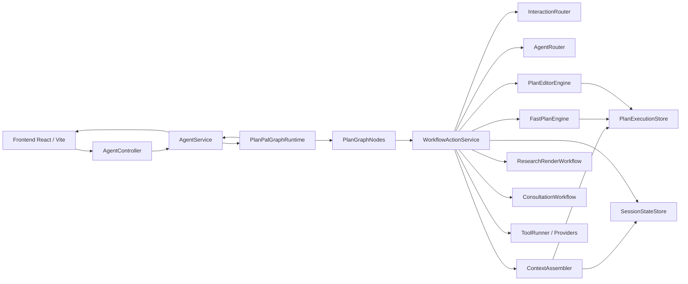
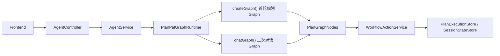
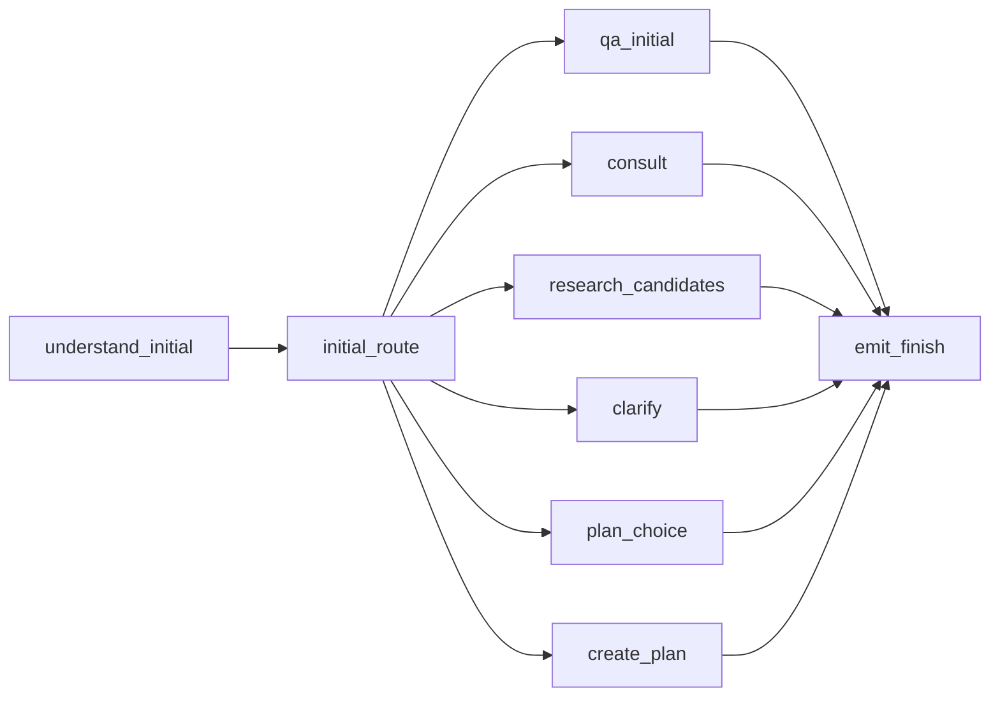
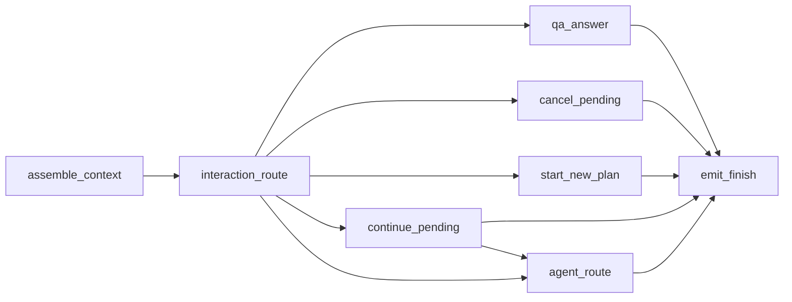

# PlanPal 交互路由架构

> 当前主路径是 `AgentController -> AgentService -> PlanPalGraphRuntime -> PlanGraphNodes -> WorkflowActionService`。`AgentWorkflowEngine` 仍保留，但只是兼容外壳，内部继续委托给 `PlanPalGraphRuntime`。前端通过 EventSource 消费 SSE；后端用 `PlanExecutionStore` 与 `SessionStateStore` 保存草稿、候选集和 pending 状态，两者都是内存存储，应用重启后会丢失。

## 1. 总览

核心职责：

| 模块 | 职责 |
| --- | --- |
| `frontend/src/App.tsx` | 顶层页面状态、列布局、action card 分发、确认弹窗 |
| `frontend/src/hooks/usePlanStream.ts` | 首轮规划和二次对话的 SSE 生命周期、终态合并、决策态处理 |
| `frontend/src/hooks/useTimelineOperations.ts` | 拼图列上的替换、推荐空档、重排、节点改写，统一转成 chat stream 请求 |
| `frontend/src/hooks/useConfirmOrder.ts` | 确认弹窗与确认执行后的前端状态更新 |
| `frontend/src/api/agent.ts` | HTTP/SSE API 封装、SSE 事件队列、`PlanResponse -> PlanNode` 映射 |
| `AgentController` | 暴露同步计划、计划 SSE、聊天 SSE、确认执行、健康检查端点 |
| `AgentService` | 创建 `SseEmitter`、打开 `BackendNoticeSink`、调用 graph runtime、执行 confirm 外部写工具 |
| `PlanPalGraphRuntime` | 当前主 graph 运行时，负责创建首轮 graph、二次对话 graph，并清洗 graph 返回对象 |
| `PlanGraphNodes` | 定义 graph 节点和节点间路由，节点本身只编排，不放业务细节 |
| `WorkflowActionService` | 业务动作入口，封装首轮路由、QA、候选卡、pending 续跑、patch 应用 |
| `InitialRequestRouter` | 首轮输入路由，输出 `InitialRouteCommand` / `InitialRouteMode` |
| `InteractionRouter` | 二次对话路由，输出 `InteractionDecision` / `InteractionCommand` |
| `AgentRouter` | 在需要修改草稿时，把上下文理解成内部 `AgentCommand` |
| `FastPlanEngine` | 生成可执行 timeline，包含搜索、可用性、天气、冲突和修复选项 |
| `PlanEditorEngine` | 应用 `PlanPatch` / `PlanDelta` 修改已有草稿并生成新版本 |
| `ResearchRenderWorkflow` | 首轮研究/候选渲染、候选刷新、电影/商品/POI 候选卡 |
| `ConsultationWorkflow` | 开放式咨询、偏好选择、上下文补齐、咨询态候选推荐 |
| `ContextAssembler` | 从运行时存储组装只读 `ContextPack` |
| `PlanExecutionStore` | 内存草稿与版本存储 |
| `SessionStateStore` | 内存会话状态、候选集、pending 和最近事件存储 |

`PlanGraphConfig.enabled()` 和 `chatEnabled()` 目前固定返回 `true`，`agent.graph.max-model-calls` 与 `agent.graph.tool-timeout-ms` 只保留为 graph 配置项，不是运行时开关。

### 总览图和 Graph 图的关系

总览图是“组件/类之间怎么调用”，后面的首轮规划 Graph 和二次对话 Graph 是 `PlanPalGraphRuntime` 这个组件内部实际编排的两张状态图。

对应关系如下：

- “首轮规划 Graph” 对应总览图里的 `PlanPalGraphRuntime -> PlanGraphNodes -> WorkflowActionService` 这段路径，具体由 `PlanPalGraphRuntime.createGraph(...)` 创建。
- “二次对话 Graph” 也对应同一段路径，但具体由 `PlanPalGraphRuntime.chatGraph(...)` 创建。
- `PlanGraphNodes` 是 graph 节点的名字和跳转规则；每个节点真正做业务时，都会再调用 `WorkflowActionService`。

## 2. 外部入口

| 入口 | 用途 | 运行路径 |
| --- | --- | --- |
| `GET /api/v1/agent/health` | 健康检查 | `AgentController.health()` |
| `POST /api/v1/agent/plan` | 同步创建首轮草稿 | `AgentService.plan()` -> `PlanPalGraphRuntime.createPlan()` |
| `GET /api/v1/agent/plan/stream` | SSE 创建首轮草稿 | `AgentService.planStream()` -> `PlanPalGraphRuntime.createPlanStreaming()` |
| `GET /api/v1/agent/plan/{planId}/chat/stream` | SSE 二次对话、选择、patch、pending 续跑 | `AgentService.planChatStream()` -> `PlanPalGraphRuntime.executeChat()` |
| `POST /api/v1/agent/plan/{planId}/confirm` | 确认并执行外部写操作 | `AgentService.confirmPlan()` |

SSE 路径都会先发送心跳 comment。`AgentService` 还会用 `BackendNoticeSink` 将后端运行时诊断转成 `BACKEND_NOTICE` 事件，便于前端 DevColumn 观察 provider、工具或异常降级信息。

## 3. 首轮规划 Graph

入口是 `POST /api/v1/agent/plan` 或 `GET /api/v1/agent/plan/stream`。

首轮路由步骤：

1. `PlanGraphNodes.understandInitial()` 调用 `WorkflowActionService.routeInitial()`。
2. `WorkflowActionService.routeInitial()` 委托 `InitialRequestRouter`，返回 `InitialRouteCommand`。
3. `PlanGraphNodes.routeAfterInitial()` 根据 `InitialRouteMode` 选择下一个节点。
4. 只有 `CREATE_PLAN` 模式还会经过 `WorkflowActionService.shouldOfferInitialPlanChoices(...)` 判断。普通首轮规划默认先进入 `plan_choice`；带有 `[BUILD_SELECTED_PLAN]` / `BUILD_SELECTED_PLAN` 标记的结构化请求会绕过选择门，直接进入 `create_plan`。

`InitialRouteMode` 当前取值：

| 模式 | graph 节点 | 典型场景 |
| --- | --- | --- |
| `CONVERSATIONAL_QA` | `qa_initial` | 用户只是提问或闲聊式咨询，不创建可编辑草稿 |
| `CONSULT_CHAT` | `consult` | 开放式规划咨询，需要偏好选择或进一步上下文 |
| `RESEARCH_AND_RENDER` | `research_candidates` | 先研究并展示候选卡，不直接生成完整 timeline |
| `ASK_CLARIFICATION` | `clarify` | 时间、人数等关键槽位不足，先提问或给槽位卡 |
| `CREATE_PLAN` | `plan_choice` 或 `create_plan` | 普通计划请求或结构化构建请求 |

普通首轮规划的默认体验：

1. 后端创建空 timeline 草稿。
2. 返回 `ActionCard(cardKind=PLAN_CHOICE)`，通常包含 3 个 `BUILD_PLAN` 选项。
3. `executionStatus=OPTIONS_READY`，`timeline=[]`。
4. `SessionStateStore` 保存 `PendingAction(type=PLAN_CHOICE)`，并把每个 choice 的 id、label、prompt、poiIds 放入 `collectedSlots`。
5. 前端只在聊天列渲染方案选项，不把空 timeline 写入拼图列。

用户选择方案后的路径：

1. 前端通过 chat stream 发送 `prompt=BUILD_PLAN:choice-N`，`source=action-card:BUILD_PLAN`，`clientActionId=<option.id>`。
2. 二次对话 graph 识别当前 pending 是 `PLAN_CHOICE`，进入 `continue_pending`。
3. 后端根据 pending 中保存的 choice 信息组装 `[BUILD_SELECTED_PLAN] ...`。
4. `FastPlanEngine` 生成可执行 timeline。
5. 返回带 timeline 的 `FINISH`，前端才填充拼图列。

槽位补齐的首轮路径：

- 如果普通首轮请求缺少时间或人数，后端可返回 `ActionCard(cardKind=SLOT_COLLECTION)`，保存 `PendingAction(type=INITIAL_PLAN_SLOT_FILLING)`。
- 用户通过 `SET_SLOT` 选项或自然语言补齐槽位后，不直接生成拼图，而是继续进入 `PLAN_CHOICE`，保持“先选方向，再生成 timeline”的一致体验。

## 4. 二次对话 Graph

入口是 `GET /api/v1/agent/plan/{planId}/chat/stream`。

执行顺序：

1. `assemble_context` 调用 `ContextAssembler.assemblePack(...)`。
2. `ContextAssembler` 从 `PlanExecutionStore` 找草稿，校验 `userId` 所有权，再调用 `SessionStateStore.syncDraft(...)` 合并当前草稿到会话状态。
3. `interaction_route` 合并 `source` 和 `clientActionId`，调用 `InteractionRouter.route(...)`，同时解析 query 参数里的结构化 `patch`。
4. `routeAfterInteraction()` 根据 `InteractionCommand` 选择 `qa_answer`、`cancel_pending`、`start_new_plan`、`continue_pending` 或 `agent_route`。
5. `continue_pending` 如果完全处理了 pending，会直接结束；如果没有处理，会落到 `agent_route` 继续由 `AgentRouter` 决策。

`InteractionCommand` 当前取值：

| 命令 | 下游节点 | 说明 |
| --- | --- | --- |
| `CONVERSATIONAL_QA` | `qa_answer` | 只读问答，不修改草稿 |
| `SMALLTALK_HELP` | `qa_answer` | 小对话或帮助类回复，不修改草稿 |
| `CONTINUE_WORKFLOW` | `continue_pending` | 继续 pending，如选方案、选候选、补槽位 |
| `MODIFY_PLAN` | `agent_route` | 修改已有 timeline |
| `START_NEW_PLAN` | `start_new_plan` | 在聊天中重新发起计划 |
| `CANCEL_PENDING` | `cancel_pending` | 取消当前 pending |

`InteractionRouter` 的优先级大致是：

1. 显式 UI action / `source` / `clientActionId`。
2. query 参数中的结构化 `patchPayload`。
3. 当前 `pendingAction` 的槽位补全或选择。
4. `TurnUnderstandingService` 对自然语言的理解结果。
5. LLM 路由。
6. 规则兜底。

`AgentRouter` 当前会产生的主要内部命令：

- `BUILD_SELECTED_PLAN_CHOICE`
- `APPLY_CANDIDATE_TO_PLAN`
- `REPLACE_SEGMENT_WITH_CANDIDATES`
- `EXTEND_PLAN_END_TIME`
- `APPLY_FEEDBACK_PATCH`
- `APPLY_DIRECT_PATCH`
- `CANCEL_PENDING_ACTION`

## 5. 状态模型

`PlanExecutionStore` 是按 `planId` 保存的内存 `ConcurrentHashMap`。`DraftPlan` 字段：

- `planId`
- `userId`
- `intent`
- `timeline`
- `orderIntents`
- `notificationText`
- `version`
- `previousVersionId`
- `status`
- `lastConfirmedVersion`
- `idempotencyKey`
- `updatedAt`

`DraftPlan.nextVersion(...)` 会递增 `version` 并写入 `previousVersionId`。`DraftPlan.withStatus(...)` 用于确认执行阶段更新 `CONFIRMING`、`CONFIRMED`、`PARTIALLY_BOOKED`、`FAILED` 等状态。

`SessionStateStore` 也是按 `planId` 保存的内存 `ConcurrentHashMap`。`SessionState` 字段：

- `sessionId`
- `planId`
- `userId`
- `currentPlan`
- `lastCandidates`
- `pendingAction`
- `userConstraints`
- `recentEvents`
- `lockedSegments`
- `updatedAt`

`SessionStateStore` 的保留策略：

- 候选集保留上限由 `agent.runtime.candidate-set-retention` 控制，默认 5。
- 最近事件保留上限由 `agent.runtime.recent-event-retention` 控制，默认 10。
- `syncDraft(...)` 会把最新草稿 timeline 合并到 `currentPlan`，并把 draft intent 合并进 `userConstraints`。

`PendingAction` 是跨轮交互的关键状态，不是 UI 装饰数据。字段：

- `type`
- `candidateSetId`
- `targetSegmentId`
- `expectedReplies`
- `workflowType`
- `selectedPatch`
- `selectedLabel`
- `requiredSlots`
- `collectedSlots`
- `preserveAfterQa`

当前源码中实际创建的 pending 类型包括：

- `INITIAL_PLAN_SLOT_FILLING`
- `PLAN_CHOICE`
- `SELECT_PREFERENCE`
- `ASK_CONTEXT`
- `SELECT_CANDIDATE`
- `MOVIE_SCHEDULING`
- `PLAN_SLOT_FILLING`

部分路由和搜索兼容逻辑仍识别 `REPLACE_SEGMENT`、`QUEUE_REPAIR`、`PRODUCT_RESEARCH` 等历史/语义型状态，用于保持候选、修复和商品研究流程的路由稳定。

`ContextPack` 是二次对话用的只读快照：

- `userId`
- `planId`
- `userTurn`
- `draft`
- `selectedSegmentId`
- `pendingAction`
- `activeCandidates`
- `recentEvents`
- `constraints`
- `allowedTools`
- `contextVersion`

业务代码不应把 `ContextPack` 当作持久状态写回；需要变更时写 `PlanExecutionStore` 或 `SessionStateStore`。

## 6. Action Card 语义

常见 `cardKind`：

| `cardKind` | 语义 | 前端处理 |
| --- | --- | --- |
| `PLAN_CHOICE` | 首轮方案方向选择 | 只渲染在聊天列；`executionStatus=OPTIONS_READY` 时保持拼图为空 |
| `SLOT_COLLECTION` | 后端要求补齐时间、人数、地点或顺序 | 渲染后端给出的 `SET_SLOT` 选项，也允许自然语言输入 |
| `PREFERENCE` | 咨询态偏好选择 | 发送 `SELECT_PREFERENCE` / `PREFERENCE:*` 继续咨询流 |
| `POI` | 地点候选 | 选择后通常转成 `SUBMIT_PATCH` 或候选选择 pending |
| `MOVIE_SCREENING` | 电影或电影+就餐候选 | 前端渲染电影场次信息，后端可能进入 `MOVIE_SCHEDULING` |
| `PRODUCT_RESEARCH` | 商品/餐品研究候选 | 先展示候选，再由用户选择转换成 patch |
| `QUEUE_REPAIR` | 冲突/排队修复建议 | 保持可见，直到用户选择修复动作 |

常见 `actionType`：

- `BUILD_PLAN`
- `SET_SLOT`
- `SELECT_PREFERENCE`
- `REQUEST_POI_RESEARCH`
- `SUBMIT_PATCH`
- `OPEN_REWRITE`
- `OPEN_REPLACE`
- `REORDER_HINT`
- `ROLLBACK_VERSION`

前端约定：

- `CHAT_ONLY` 表示只读回复，不应创建或覆盖可编辑草稿。
- `OPTIONS_READY` / `PLAN_CHOICE` 表示决策态，不应写入拼图列。
- `FINISH + actionCard + timeline` 表示 timeline 已可见，但仍有待用户决策的卡片。
- `SLOT_COLLECTION` 由后端主导，前端不自行推断缺失槽位。
- 候选刷新使用结构化 prompt，如 `[REFRESH_CANDIDATES] cardKind=... exclude...` 或 `[REFINE_CANDIDATES] ...`，后端从当前 pending/candidate set 中恢复上下文。

## 7. SSE 事件

当前前端会注册这些事件名：

- `START`
- `INTENT`
- `THOUGHT`
- `ACTION`
- `OBSERVATION`
- `PLAN_STEP`
- `PLAN_STARTED`
- `INTENT_EXTRACTED`
- `WEATHER_CHECKED`
- `CANDIDATES_SEARCHING`
- `CANDIDATES_FOUND`
- `AVAILABILITY_CHECKED`
- `SEGMENT_PLANNED`
- `CONFLICT_DETECTED`
- `REPAIR_OPTIONS_READY`
- `PLAN_ASSEMBLED`
- `PLAN_FINISHED`
- `PLAN_FAILED`
- `PLAN_NARRATIVE`
- `BACKEND_NOTICE`
- `FINISH`
- `ERROR`

终态规则：

- 前端只把 `FINISH` 和 `ERROR` 当作终态。
- `FINISH` 会转换成 `AgentPlanResponse`，再根据 `executionStatus`、`actionCard.cardKind` 和 timeline 决定是否填充拼图。
- `ERROR` 会结束 EventSource，并展示失败信息。
- 其他事件用于流式展示和 DevColumn 调试。

`SseEvent` 负载里可能包含：

- `timeline`
- `planId`
- `intent`
- `orderIntents`
- `executionStatus`
- `planPatch`
- `actionCard`
- `planDelta`
- `conflicts`
- `repairOptions`
- `version`
- `planStatus`
- `weather`
- `summary`
- `variants`

`BackendNoticeSink` 会把后端诊断包装为：

- `type=BACKEND_NOTICE`
- `executionStatus=DIAGNOSTIC`
- `content=[LEVEL] Source: message`

## 8. 前端状态流

首轮提交：

1. `IntroScreen` 调用 `usePlanStream.submitRequirement(...)`。
2. 前端清空当前 plan、timeline、候选 UI 状态，进入 `stage=planning`。
3. `requestPlanStream(...)` 创建 EventSource。
4. `onEvent` 追加到 `sseEvents`，供 DevColumn 展示。
5. `onTimeline` 对带 timeline 的增量事件调用 `mapPlanResponseToNodes(...)`。
6. `onFinish` 根据决策态或可执行 timeline 更新聊天列、拼图列、`currentPlan` 和 `planSummary`。

二次对话：

1. 聊天输入、action card、拼图操作都会进入 `runChatAdjustment(...)`。
2. 拼图替换、空档推荐、拖拽重排会构造 `AgentPlanPatch`，通过 chat stream 的 `patch` query 参数发送。
3. 如果 `currentPlan.planId` 不存在，普通聊天会合并到首轮需求并重新发起规划。
4. 前端限制 EventSource URL 长度为 1800 字符；过长的结构化 patch 会直接在前端报错，避免浏览器/代理截断。

拼图列写入规则：

- 决策态：`executionStatus=OPTIONS_READY`、`status=OPTIONS_READY` 或 `actionCard.cardKind=PLAN_CHOICE` 时，`planNodes=[]`。
- 可执行态：响应中有 timeline 时，通过 `mapPlanResponseToNodes(...)` 映射成 `PlanNode[]`。
- 只读态：`CHAT_ONLY` 或没有 timeline 的 QA 回复不覆盖已有拼图。

## 9. 确认执行

确认入口是 `POST /api/v1/agent/plan/{planId}/confirm`。

流程：

1. 前端 `useConfirmOrder.openConfirmModal()` 打开确认弹窗。
2. 前端提交当前排序后的 `timeline`、`headcount`、`notificationText`、`version`、`idempotencyKey`。
3. `AgentService.confirmPlan(...)` 从 `PlanExecutionStore` 读取草稿。
4. 如果请求带 `version` 且与草稿版本不一致，后端抛出版本过期错误。
5. 如果 `idempotencyKey` 已执行过且草稿已确认或部分预订，后端直接返回幂等结果。
6. 后端先把草稿状态更新为 `CONFIRMING`。
7. 后端根据提交的 timeline 生成确认期 `OrderIntent` 并调用外部写工具：
   - `bookTickets`
   - `reserveRestaurant`
   - `hailRide`
   - `executeOrderAndNotify`
8. 写工具结果会映射回 timeline 节点的 `bookingStatus` / `executionStatus`。
9. `PlanExecutionStore` 保存最终状态：`CONFIRMED`、`PARTIALLY_BOOKED` 或 `FAILED`。
10. 前端根据 `ConfirmPlanResponse` 更新 `currentPlan`、拼图列和确认弹窗状态。

注意：确认期使用的是 `ToolRunner.runExternalWrite(...)`，和规划期的只读搜索/候选流程边界不同。新增真实外部写集成时，应优先替换 provider/tool 层，不要把写操作塞进 graph 路由节点。

## 10. 扩展边界

新增首轮意图：

- 优先扩展 `InitialRequestRouter` / `InitialTurnRouter`。
- 如果需要新 graph 节点，再改 `PlanGraphNodes` 和 `PlanPalGraphRuntime.createGraph(...)`。
- 如果只是新的业务动作，优先放在 `WorkflowActionService` 或具体 workflow 中。

新增二次对话动作：

- UI 显式动作先定义 `source` / `clientActionId` / `actionType`。
- 自然语言路由扩展 `InteractionRouter` 或 `TurnUnderstandingService`。
- 真正修改 timeline 的动作尽量表达为 `PlanPatch` / `PlanDelta`，复用 `PlanEditorEngine`。

新增候选卡：

- 后端返回新的 `cardKind` / `optionKind` 前，需要确认前端 `PlanPalChatColumn` 的渲染分支。
- 候选选择后应保存 `CandidateSet` 和合适的 `PendingAction`，否则用户后续说“换一批”“选第二个”会丢上下文。

新增持久化：

- `PlanExecutionStore` 和 `SessionStateStore` 目前是内存实现。若接入数据库，应保留现有接口语义，特别是 `syncDraft(...)`、候选集保留、recent events 保留、版本号和幂等键行为。

## 11. 相关文件

| 文件 | 说明 |
| --- | --- |
| `backend/src/main/java/com/weekendplanner/controller/AgentController.java` | HTTP/SSE API |
| `backend/src/main/java/com/weekendplanner/service/AgentService.java` | API 编排、SSE emitter、确认执行 |
| `backend/src/main/java/com/weekendplanner/engine/graph/PlanPalGraphRuntime.java` | graph 运行时 |
| `backend/src/main/java/com/weekendplanner/engine/graph/PlanGraphNodes.java` | graph 节点和节点路由 |
| `backend/src/main/java/com/weekendplanner/engine/workflow/WorkflowActionService.java` | 业务动作入口 |
| `backend/src/main/java/com/weekendplanner/engine/workflow/FastPlanEngine.java` | 可执行 timeline 生成 |
| `backend/src/main/java/com/weekendplanner/engine/workflow/ResearchRenderWorkflow.java` | 研究与候选卡 |
| `backend/src/main/java/com/weekendplanner/engine/workflow/ConsultationWorkflow.java` | 咨询态工作流 |
| `backend/src/main/java/com/weekendplanner/engine/interaction/InteractionRouter.java` | 二次对话路由 |
| `backend/src/main/java/com/weekendplanner/engine/routing/AgentRouter.java` | 内部命令路由 |
| `backend/src/main/java/com/weekendplanner/engine/context/ContextAssembler.java` | 上下文组装 |
| `backend/src/main/java/com/weekendplanner/engine/runtime/PlanExecutionStore.java` | 草稿存储 |
| `backend/src/main/java/com/weekendplanner/engine/context/SessionStateStore.java` | 会话状态存储 |
| `backend/src/main/java/com/weekendplanner/engine/runtime/BackendNoticeSink.java` | 后端诊断事件出口 |
| `frontend/src/api/agent.ts` | 前端 API/SSE 封装和 PlanNode 映射 |
| `frontend/src/hooks/usePlanStream.ts` | 规划/聊天 SSE 状态管理 |
| `frontend/src/hooks/useTimelineOperations.ts` | 拼图操作到 patch/chat 的转换 |
| `frontend/src/hooks/useConfirmOrder.ts` | 确认执行 |
| `frontend/src/components/PlanPalChatColumn.tsx` | action card 渲染 |
