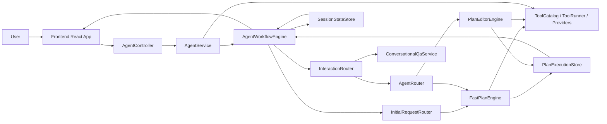
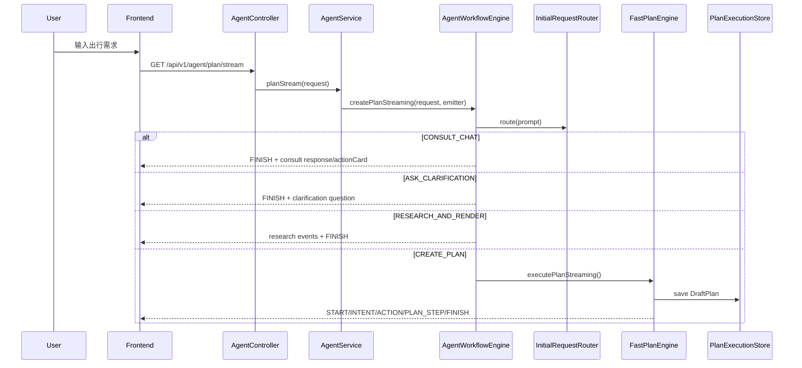
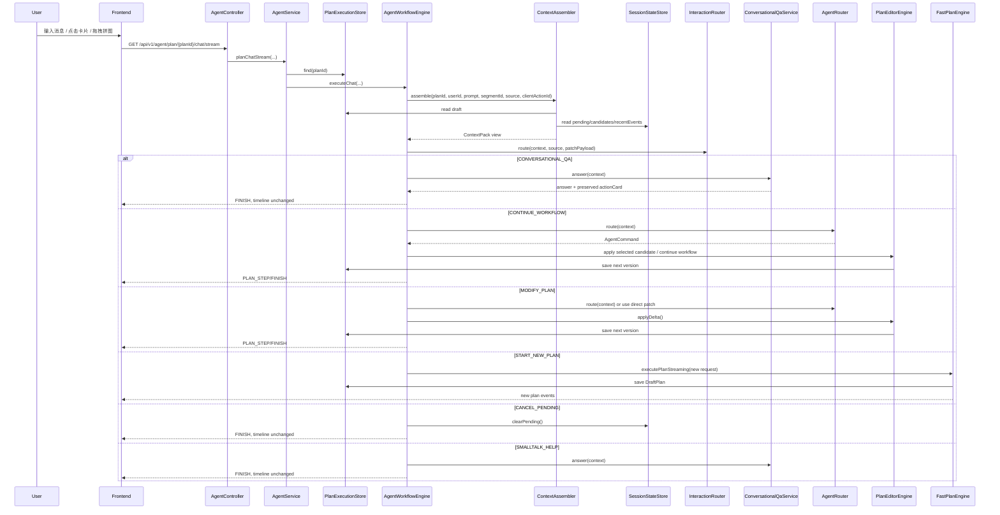
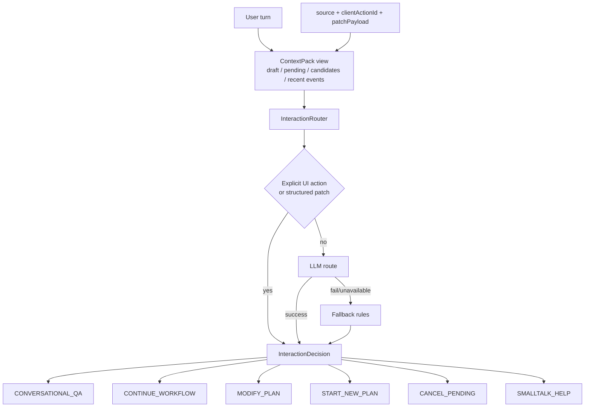
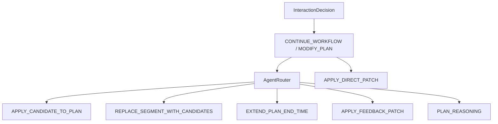
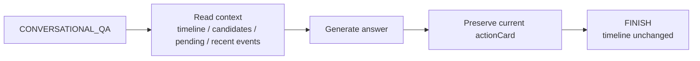
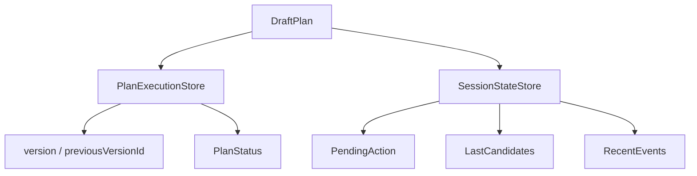
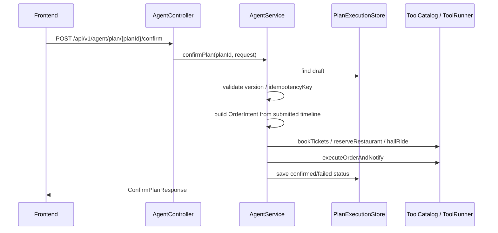
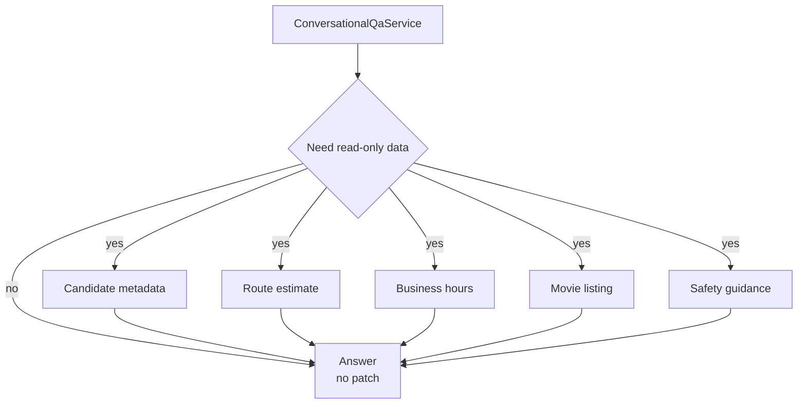

# PlanPal 交互路由架构

> Current runtime: PlanPal uses Spring AI Alibaba Graph Core as the workflow orchestration boundary,
> Spring AI/Spring AI Alibaba `ToolCallback` integration through `ToolCatalog` / `ToolRunner`,
> and `ContextPack` as the canonical context source. The legacy reasoning runtime is not part of the active path.
>
> Runtime ownership update: `PlanPalGraphRuntime` now owns the create-plan graph and the optional chat graph.
> `AgentWorkflowEngine` is a compatibility facade; reusable business actions live in `WorkflowActionService`.
> `agent.graph.enabled=false` falls back to the facade path, and `agent.graph.chat-enabled=true` routes chat turns
> through the graph state machine. Existing HTTP endpoints, SSE event types, timeline shape, and `TRANSIT`
> contract are unchanged.

本文说明 PlanPal 的交互路由、规划编排、二次对话分流和上下文状态链路。

PlanPal 的运行结构：

```text
LLM intent router
+ workflow executor
+ plan generator/editor
+ contextual QA
+ tool providers
+ SSE-driven frontend
```

核心原则：

```text
二次对话先判断用户意图。
pending action、候选卡、当前 timeline、recent events 都是路由上下文。
```

## 1. 总览



| 模块 | 职责 |
| --- | --- |
| `frontend/src/App.tsx` | 管理页面阶段、拼图节点、聊天消息、SSE 事件、确认弹窗 |
| `frontend/src/api/agent.ts` | 封装 plan stream、chat stream、confirm API |
| `AgentController` | 暴露 REST/SSE 接口 |
| `AgentService` | 创建 SSE emitter，调用 workflow，执行 confirm 下单 |
| `AgentWorkflowEngine` | 统一编排首次规划、二次对话、候选卡、patch、QA |
| `InitialRequestRouter` | 首次输入路由 |
| `InteractionRouter` | 二次对话意图路由 |
| `AgentRouter` | workflow 内部命令路由 |
| `FastPlanEngine` | 生成完整 timeline |
| `PlanEditorEngine` | 应用 `PlanDelta` / `PlanPatch` 修改 timeline |
| `ConversationalQaService` | 流程内问答，只读上下文并保留当前卡片 |
| `PlanExecutionStore` | 保存 draft plan、version、status |
| `SessionStateStore` | 保存 pending action、last candidates、recent events |
| `ToolCatalog / ToolRunner / Providers` | 提供 POI、电影、可用性、订座、票务、打车、通知等能力 |

## 2. API 入口

| 场景 | 前端函数 | 后端接口 | 后端入口 |
| --- | --- | --- | --- |
| 首次生成计划 | `requestPlanStream` | `GET /api/v1/agent/plan/stream` | `AgentService.planStream` |
| 二次对话/改计划 | `requestPlanChatStream` | `GET /api/v1/agent/plan/{planId}/chat/stream` | `AgentService.planChatStream` |
| 确认执行 | `confirmPlan` | `POST /api/v1/agent/plan/{planId}/confirm` | `AgentService.confirmPlan` |

## 3. 首次规划链路

首次输入用于创建草稿计划，入口是 `requestPlanStream`。



首次规划输出：

- `planId`
- `intent`
- `timeline`
- `orderIntents`
- `summary`
- `notificationText`
- `version`
- `planStatus`
- `actionCard`，可选

## 4. 二次对话链路

二次对话用于处理已有 plan 上的追问、选择、修改、取消和新计划请求，入口是 `requestPlanChatStream`。



二次对话的上下文对象 `ContextPack view` 包含：

- 当前 `DraftPlan`
- 当前用户输入
- `segmentId`
- `source`
- `clientActionId`
- `pendingAction`
- `lastCandidates`
- `recentEvents`
- 当前用户约束

## 5. InteractionRouter

`InteractionRouter` 是二次对话的第一层路由。



| command | 典型输入 | 后续处理 |
| --- | --- | --- |
| `CONVERSATIONAL_QA` | “这几个有什么区别？”、“第二个适合聊天吗？”、“头孢能喝酒吗？” | `ConversationalQaService.answer` |
| `CONTINUE_WORKFLOW` | “就第二个”、“换一批”、“按这个偏好继续” | `AgentRouter` 继续候选/偏好/pending 流程 |
| `MODIFY_PLAN` | “把晚饭换成火锅”、“延长到十点”、“删掉酒吧” | `PlanPatchExtractor` / `PlanEditorEngine` |
| `START_NEW_PLAN` | “重新来，明天下午两个人看展吃饭” | `FastPlanEngine` 创建新草稿 |
| `CANCEL_PENDING` | “算了，不选这个了”、“取消当前候选” | `SessionStateStore.clearPending` |
| `SMALLTALK_HELP` | “你能做什么？”、“这个页面怎么用？” | `ConversationalQaService.answer` |

路由优先级：

1. 显式 UI action 或结构化 patch。
2. LLM route，用于自由文本。
3. fallback rules，用于 LLM 不可用或解析失败。

## 6. AgentRouter

`AgentRouter` 处理 workflow 内部命令。



`AgentRouter` 关注的问题：

- 用户是否选择了候选 index
- 是否要求替换当前 segment
- 是否要求延长结束时间
- 是否需要 LLM reasoning fallback
- 是否应用自然语言反馈 patch

## 7. ConversationalQaService

`CONVERSATIONAL_QA` 用于流程内问答。



可读取：

- 当前 timeline
- 当前 pending action
- 最近候选集 `lastCandidates`
- 最近事件 `recentEvents`
- 当前 action card 相关信息

输出约束：

- 返回自然语言回答
- 可返回保留后的 action card
- 不应用 patch
- 不自动选择候选
- 不清除 pending
- 不更新 timeline
- 不声明订票、订座或下单完成

典型场景：

| 输入 | pending | 路由 |
| --- | --- | --- |
| “这几个有什么区别？” | `SELECT_CANDIDATE` | `CONVERSATIONAL_QA` |
| “第二个是不是太吵？” | `SELECT_CANDIDATE` | `CONVERSATIONAL_QA` |
| “头孢能喝酒吗？” | 任意 | `CONVERSATIONAL_QA` |
| “那就第二个” | `SELECT_CANDIDATE` | `CONTINUE_WORKFLOW` |
| “换一批” | `SELECT_CANDIDATE` | `CONTINUE_WORKFLOW` |
| “把晚饭换成火锅” | 任意 | `MODIFY_PLAN` |
| “取消这个候选” | `SELECT_CANDIDATE` | `CANCEL_PENDING` |

## 8. 状态与版本



`PlanExecutionStore.DraftPlan` 保存：

- `planId`
- `userId`
- `intent`
- `timeline`
- `orderIntents`
- `notificationText`
- `version`
- `previousVersionId`
- `status`
- `lastConfirmedVersion`
- `idempotencyKey`
- `updatedAt`

`SessionStateStore` 保存交互状态：

- 当前 pending action
- 最近候选集
- 用户约束
- recent events

## 9. 确认执行链路

确认执行由前端确认弹窗触发。



确认阶段会使用前端提交的当前 timeline。这样地图交通选择、拖拽排序和本地确认人数都能进入最终执行请求。

## 10. 后续扩展：只读工具

当前 `ConversationalQaService` 主要读取上下文。后续可以接入只读工具，增强流程内问答。



建议能力：

| 工具 | 用途 |
| --- | --- |
| `CandidateExplainTool` | 解释候选差异、适合人群、优缺点 |
| `RouteEstimateReader` | 查询距离、交通耗时、步行压力 |
| `BusinessHoursReader` | 查询营业时间、闭店风险 |
| `MovieListingReader` | 查询电影时长、场次、结束时间 |
| `SafetyAdviceReader` | 提供保守安全建议 |

只读工具的约束：

```text
可以读取上下文和外部信息。
不写 timeline。
不提交订单。
不替用户选择。
```

## 11. 关键文件

| 文件 | 说明 |
| --- | --- |
| `frontend/src/App.tsx` | 前端状态、SSE 消费、二次对话提交、确认弹窗 |
| `frontend/src/api/agent.ts` | API 封装和 SSE event 处理 |
| `backend/src/main/java/com/weekendplanner/controller/AgentController.java` | HTTP/SSE controller |
| `backend/src/main/java/com/weekendplanner/service/AgentService.java` | service 编排和 confirm 执行 |
| `backend/src/main/java/com/weekendplanner/engine/workflow/AgentWorkflowEngine.java` | 核心 workflow |
| `backend/src/main/java/com/weekendplanner/engine/interaction/InteractionRouter.java` | 二次对话路由 |
| `backend/src/main/java/com/weekendplanner/engine/interaction/ConversationalQaService.java` | 流程内问答 |
| `backend/src/main/java/com/weekendplanner/engine/routing/AgentRouter.java` | workflow 命令路由 |
| `backend/src/main/java/com/weekendplanner/engine/workflow/FastPlanEngine.java` | 快速规划 |
| `backend/src/main/java/com/weekendplanner/engine/patch/PlanEditorEngine.java` | 修改计划 |
| `backend/src/main/java/com/weekendplanner/engine/runtime/PlanExecutionStore.java` | 草稿和版本 |

## Current Action Card Contract

- `CHAT_ONLY` responses are read-only answers and must not become an active editable draft on the frontend.
- `FINISH + actionCard + timeline` means the timeline is visible but a user decision is still pending; the frontend must preserve the card instead of replacing it with a generic completion message.
- `SLOT_COLLECTION` is backend-owned. The frontend renders the provided option groups and must not infer missing fields from chat text.
- `QUEUE_REPAIR` and `REPLACEMENT_FALLBACK` are workflow states, not decoration. They should remain visible until the user selects a repair, replacement, or fallback action.
- `PRODUCT_RESEARCH` renders product/merchant candidates first; selecting one converts it to a normal plan patch for the linked POI.
