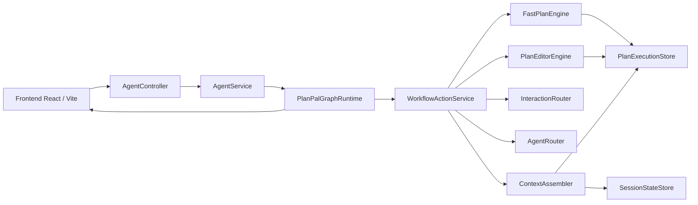
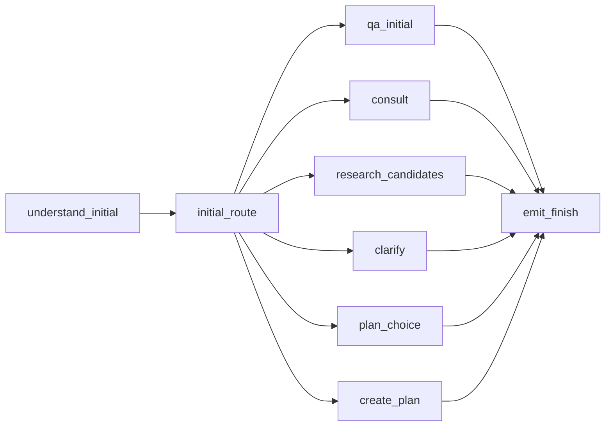
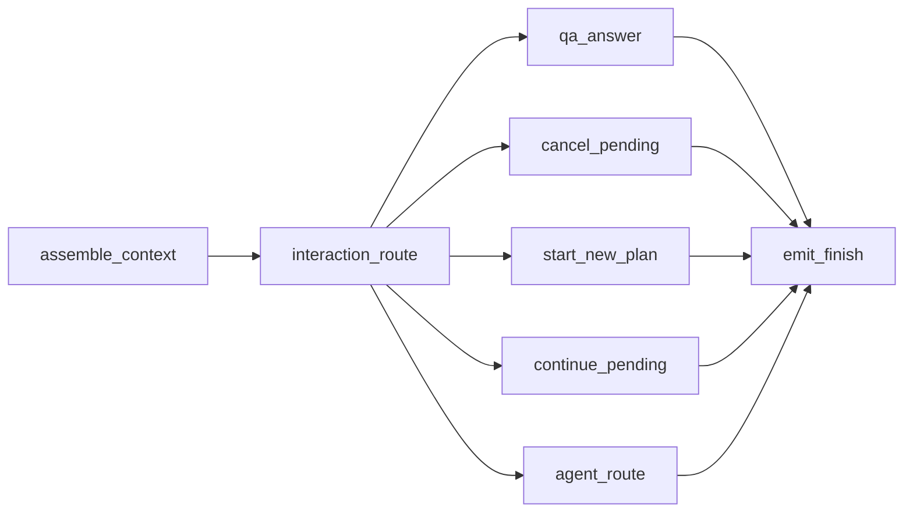

# PlanPal 交互路由架构

> 当前运行时以 `PlanPalGraphRuntime` 为主入口，`AgentWorkflowEngine` 只保留兼容外壳。前端通过 SSE 消费事件，后端用 `PlanExecutionStore` 和 `SessionStateStore` 保存草稿与交互状态，两者都是内存存储，重启会丢失。

## 1. 总览

核心职责：

| 模块 | 职责 |
| --- | --- |
| `frontend/src/App.tsx` | 页面状态、列布局、SSE 消费、确认弹窗 |
| `frontend/src/api/agent.ts` | 封装 plan / chat / confirm 三类接口 |
| `AgentController` | 暴露 HTTP + SSE 端点 |
| `AgentService` | 创建 SSE emitter，串联 graph/runtime，执行 confirm |
| `PlanPalGraphRuntime` | 当前主运行时，承接创建草案和二次对话 graph |
| `WorkflowActionService` | 复用的业务动作入口，负责路由、QA、候选卡、patch |
| `FastPlanEngine` | 在用户选定方案后生成完整草案 timeline |
| `PlanEditorEngine` | 应用 `PlanPatch` / `PlanDelta` 修改草案 |
| `InteractionRouter` | 二次对话意图路由 |
| `AgentRouter` | workflow 内部命令路由 |
| `ContextAssembler` | 组装只读 `ContextPack` |
| `PlanExecutionStore` | 草案与版本 |
| `SessionStateStore` | pending、候选集、最近事件 |

`PlanGraphConfig.enabled()` 和 `chatEnabled()` 目前都恒为 `true`，没有实际的运行时开关。图运行时是默认路径。

## 2. 首次规划 graph

入口是 `POST /api/v1/agent/plan` 或 `GET /api/v1/agent/plan/stream`。

路由规则：

1. `InitialRequestRouter` 先用 `InitialTurnRouter` 分析首轮输入。
2. `InitialRouteMode` 可能是 `CONVERSATIONAL_QA`、`CONSULT_CHAT`、`RESEARCH_AND_RENDER`、`CREATE_PLAN`、`ASK_CLARIFICATION`。
3. `PlanGraphNodes.routeAfterInitial()` 将模式映射到 graph 节点。`CREATE_PLAN` 会先经过 `WorkflowActionService.shouldOfferInitialPlanChoices(...)` 判断；普通首轮规划先进入 `PLAN_CHOICE`，结构化 `BUILD_SELECTED_PLAN` 才直接进入 `create_plan`。
4. `qa_initial`、`consult`、`research_candidates`、`clarify`、`plan_choice` 都会直接产出 `PlanResponse` 并结束，不暴露底层工具调用。
5. `create_plan` 调用 `FastPlanEngine.executePlan(...)` 或 `executePlanStreaming(...)` 生成完整草案。

补充：

- `PLAN_CHOICE` 节点现在是普通首轮规划的默认前置步骤，会返回 3 个方案方向，`timeline=[]`，`executionStatus=OPTIONS_READY`，并保存 `PendingAction(type=PLAN_CHOICE)`。
- `SLOT_COLLECTION` 补齐时间/人数后不会直接生成拼图，而是继续进入 `PLAN_CHOICE`，仍保持拼图为空。
- 用户点击某个方案方向后，前端通过 chat stream 发送 `BUILD_PLAN:choice-N` / `action-card:BUILD_PLAN`，后端组装 `[BUILD_SELECTED_PLAN] ...` 请求并调用 FastPlan 生成可执行 timeline。
- `RESEARCH_AND_RENDER` 是当前仍在用的首轮路径，不是历史遗留名词。
- graph 事件同时保留内部节点记录和对前端可见的 SSE 事件。

## 3. 二次对话 graph

入口是 `GET /api/v1/agent/plan/{planId}/chat/stream`。

执行顺序：

1. `ContextAssembler` 从 `PlanExecutionStore` 和 `SessionStateStore` 读取当前草案、pending、候选集、最近事件，组装成 `ContextPack`。
2. `InteractionRouter` 先看显式 UI action、结构化 patch、pending 上下文，再看理解服务和 LLM 路由。
3. 路由结果会落入 `InteractionCommand`：
   - `CONVERSATIONAL_QA`
   - `CONTINUE_WORKFLOW`
   - `MODIFY_PLAN`
   - `START_NEW_PLAN`
   - `CANCEL_PENDING`
   - `SMALLTALK_HELP`
4. `continue_pending` 会处理 plan choice、movie scheduling、slot filling 等 pending 流程。
5. `agent_route` 进入 `AgentRouter`，执行内部命令或 patch。

`InteractionRouter` 的优先级大致是：

1. 明确的 UI action / `source`
2. 结构化 `patchPayload`
3. 当前 pending 的槽位补全
4. `TurnUnderstandingService`
5. LLM 路由
6. 规则兜底

`AgentRouter` 处理的内部命令主要是：

- `SELECT_PLAN_CHOICE`
- `APPLY_CANDIDATE_TO_PLAN`
- `REPLACE_SEGMENT_WITH_CANDIDATES`
- `EXTEND_PLAN_END_TIME`
- `APPLY_FEEDBACK_PATCH`
- `APPLY_DIRECT_PATCH`

## 4. 状态模型

`PlanExecutionStore.DraftPlan` 保存：

- `planId`
- `userId`
- `intent`
- `timeline`
- `orderIntents`
- `notificationText`
- `version`
- `previousVersionId`
- `status`
- `lastConfirmedVersion`
- `idempotencyKey`
- `updatedAt`

`SessionState` 保存：

- `currentPlan`
- `lastCandidates`
- `pendingAction`
- `userConstraints`
- `recentEvents`
- `lockedSegments`

`ContextPack` 是只读视图，给路由器和 QA 使用，不直接作为持久状态。

`SessionStateStore` 目前是内存 `ConcurrentHashMap`，并且只保留最近若干候选集和事件，具体上限由 `agent.runtime` 配置控制。

## 5. 交互语义

常见 pending 类型：

- `PLAN_CHOICE`
- `SELECT_CANDIDATE`
- `REPLACE_SEGMENT`
- `QUEUE_REPAIR`
- `PRODUCT_RESEARCH`
- `MOVIE_SCHEDULING`
- `PLAN_SLOT_FILLING`
- `ASK_CONTEXT`
- `SELECT_PREFERENCE`

这些状态是业务流程的一部分，不是装饰数据。

`ActionCard` 常见类型：

- `PLAN_CHOICE`
- `PREFERENCE`
- `POI`
- `MOVIE_SCREENING`
- `SLOT_COLLECTION`
- `QUEUE_REPAIR`

前端约定：

- `CHAT_ONLY` 只读，不应转成可编辑草稿。
- `OPTIONS_READY` / `PLAN_CHOICE` 是决策态，不应写入拼图列；前端只在聊天框渲染 action card。
- `FINISH + actionCard + timeline` 表示时间线已经可见，但用户仍需做决定。
- `SLOT_COLLECTION` 由后端主导，前端只渲染给定选项。
- `PRODUCT_RESEARCH` 先展示候选，再由选择动作转成普通 patch。
- `QUEUE_REPAIR` 和 `REPLACEMENT_FALLBACK` 应持续可见，直到用户选定修复动作。

## 6. SSE 事件

当前会看到的事件类型包括：

- `START`
- `INTENT`
- `THOUGHT`
- `ACTION`
- `OBSERVATION`
- `PLAN_STEP`
- `PLAN_STARTED`
- `INTENT_EXTRACTED`
- `WEATHER_CHECKED`
- `CANDIDATES_SEARCHING`
- `CANDIDATES_FOUND`
- `AVAILABILITY_CHECKED`
- `SEGMENT_PLANNED`
- `CONFLICT_DETECTED`
- `REPAIR_OPTIONS_READY`
- `PLAN_ASSEMBLED`
- `PLAN_FINISHED`
- `PLAN_NARRATIVE`
- `FINISH`
- `ERROR`

前端实际只需要把 `FINISH` 和 `ERROR` 当作终态处理，其余事件用于增量展示和调试。

## 7. 确认执行

确认入口是 `POST /api/v1/agent/plan/{planId}/confirm`。

流程：

1. 前端打开确认弹窗，提交当前排序后的 `timeline`、`headcount`、`notificationText`、`version`、`idempotencyKey`。
2. `AgentService.confirmPlan(...)` 先校验版本和幂等键。
3. 后端把草案时间线翻译成 `OrderIntent`。
4. 根据节点类型调用外部写工具：
   - `bookTickets`
   - `reserveRestaurant`
   - `hailRide`
   - `executeOrderAndNotify`
5. 结果写回 `PlanExecutionStore`，并返回 `ConfirmPlanResponse`。

确认阶段的状态通常会在 `CONFIRMING`、`CONFIRMED`、`PARTIALLY_BOOKED`、`FAILED` 之间变化。

## 8. 相关文件

| 文件 | 说明 |
| --- | --- |
| `backend/src/main/java/com/weekendplanner/engine/graph/PlanPalGraphRuntime.java` | 图运行时 |
| `backend/src/main/java/com/weekendplanner/engine/graph/PlanGraphNodes.java` | 图节点定义 |
| `backend/src/main/java/com/weekendplanner/engine/workflow/WorkflowActionService.java` | 业务动作入口 |
| `backend/src/main/java/com/weekendplanner/engine/interaction/InteractionRouter.java` | 二次对话路由 |
| `backend/src/main/java/com/weekendplanner/engine/routing/AgentRouter.java` | workflow 内部命令路由 |
| `backend/src/main/java/com/weekendplanner/engine/context/ContextAssembler.java` | 上下文组装 |
| `backend/src/main/java/com/weekendplanner/engine/runtime/PlanExecutionStore.java` | 草案存储 |
| `backend/src/main/java/com/weekendplanner/engine/context/SessionStateStore.java` | 会话状态存储 |
| `frontend/src/hooks/usePlanStream.ts` | SSE 消费和前端状态同步 |
| `frontend/src/hooks/useConfirmOrder.ts` | 确认执行 |
