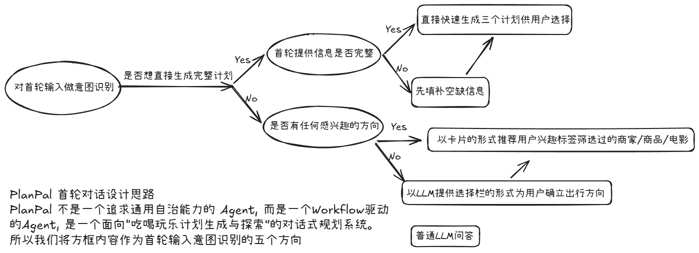
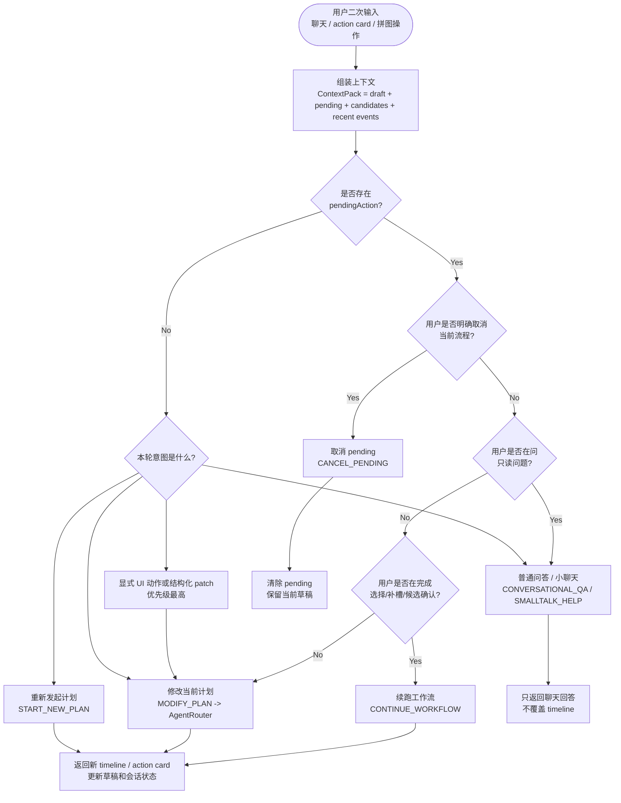

# PlanPal 策略与链路设计

> 本文说明 PlanPal 设计思路。更细的工程类图、SSE 事件和状态字段见 [INTERACTION_ROUTING_ARCHITECTURE.md](./INTERACTION_ROUTING_ARCHITECTURE.md)。

## 1. 设计定位

PlanPal 不是一个追求通用自治能力的 Agent，而是一个 workflow 驱动的对话式规划系统。它面向的核心任务是：在用户还没有完全想清楚“吃喝玩乐计划”时，帮助用户把模糊意图逐步收敛成可选择、可编辑、可执行的计划。

## 2. 交互设计

PlanPal 的主界面不是单纯的聊天框，而是以“对话 + 拼图 + 路线 + 商家”为核心的多栏工作台。用户在左侧通过自然语言和方案卡做决策，中间看到可编辑的时间线，右侧查看路线和出行方式；窄屏场景下，则通过悬浮菜单在不同功能列之间切换。

展示的是桌面端主工作台，

当 timeline 已经可执行时，用户通过确认按钮进入最终执行态

## 3. 首轮策略图

方框内即首轮路由的五个模式：CONVERSATIONAL_QA; CONSULT_CHAT; RESEARCH_AND_RENDER; ASK_CLARIFICATION; CREATE_PLAN

## 4. 二次对话策略图

二次对话不是重新理解一个孤立问题，而是在已有 `planId`、当前草稿、候选集和 `pendingAction` 上判断用户这一轮要做什么。

方框内即二次对话路由的六个命令：CONVERSATIONAL_QA; SMALLTALK_HELP; CONTINUE_WORKFLOW; MODIFY_PLAN; START_NEW_PLAN; CANCEL_PENDING

这张图的核心是：二次对话优先尊重当前 workflow 状态。只要存在 `pendingAction`，系统会先判断用户是在取消、提问，还是继续完成 pending；只有 pending 无法处理时，才落到普通计划修改。这样用户点卡片、选候选、补槽位、问一句解释性问题，都不会把上下文打断。

## 5. 三方案选择机制

普通首轮规划的默认体验是：

1. 用户输入一个相对完整的计划需求，例如“明天下午 2 个人想在附近玩到晚上”。
2. 后端识别为 `CREATE_PLAN`。
3. 系统先创建空 timeline 草稿，返回 `PLAN_CHOICE` action card。
4. action card 通常包含 3 个 `BUILD_PLAN` 选项。
5. 前端只在聊天列展示方案卡，不把空 timeline 写入拼图列。
6. 用户选择某个方向后，前端通过 chat stream 发送 `BUILD_PLAN:choice-N`。
7. 后端继续当前 pending workflow，组装 `[BUILD_SELECTED_PLAN] ...`。
8. `FastPlanEngine` 生成真正可执行的 timeline。
9. 前端再将 timeline 渲染到拼图列。

